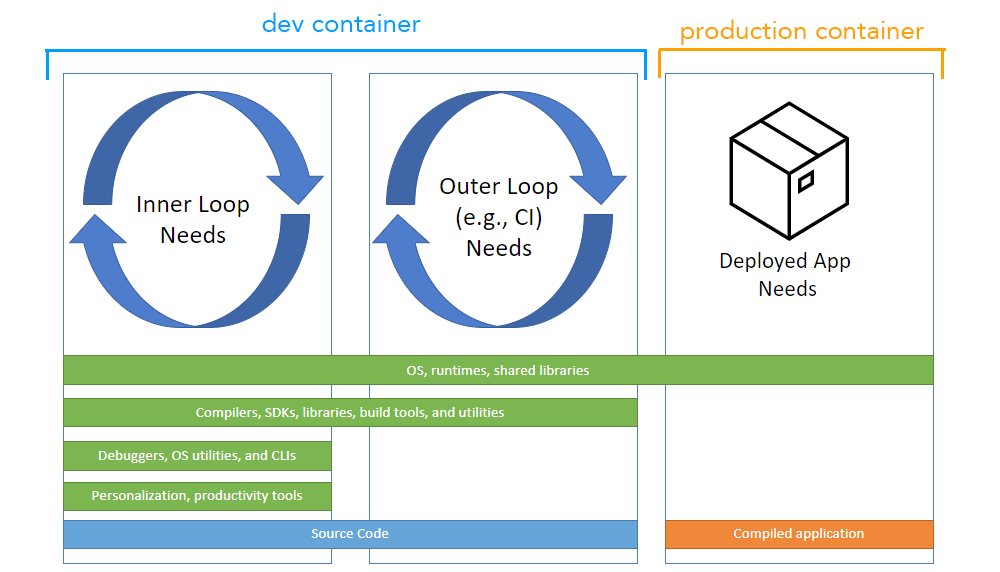

# Dev Container Training
## 概要
- devcontainerを法人環境でも使えるようにするための手順を調査/まとめる

## Todo
- ~~devcontainer内で、Fucntionsを起動する~~
- ~~説明内容を書き出す~~
  - devcontainerの概要
  - devcontainerと普通のコンテナを使う場合のメリデメ
  - devcontainerの設定ファイルの中身
  - 実際のリポジトリを使った場合のハンズオン
- ~~ubuntu上でdevcontainerを起動させる~~
- ~~実際のリポジトリを使った場合のハンズオンを書く~~
- ~~featureの中身について解説する~~
- ~~devcontainerの概要を書く~~
- ~~devcontainerの設定ファイルの中身を書く~~
- ~~devcontainerと普通のコンテナを使う場合のメリデメを書く~~
- wsl有効化・ubuntuインストール・プロキシ設定・dockerインストール・の記述を明確化
- 自分でdevcontainerを作成していく場合の手順もまとめる
- 実際のリポジトリを使った場合のハンズオンをより詳細に書く
- .vscode配下のものも整理

# まとめ
## DevConainerの概要
- 開発環境を開発者間、またはCIで環境を統一するのに使われる。
- 開発環境でよく使われる、イメージ・ツール・設定を、devconteinar用のイメージ、シェルスクリプトによるインストールスクリプト(feature)が、公開されれていることにより簡単に導入できる。
- コンテナのビルド・起動をVScodeやCodeSpaces上から行える。
- 下記イメージ  
    
  参照： https://containers.dev/overview

## DevContainerと開発向けコンテナの比較
- 開発環境の統一化をする際に、シンプルなdcokerコンテナを利用することでも同じことが実現できる。
- そのため、下記通常のコンテナと比較した際のメリデメ をまとめた

| 観点                                   | Dev Container                                                                                                              |
| -------------------------------------- | -------------------------------------------------------------------------------------------------------------------------- |
| **通常のコンテナと比較したメリット**   | - dockerコマンドなどを覚える必要がない  - インストールするツール類のポートフォワードの設定の記述を減らせる(feature機能) |
| **通常のコンテナと比較したデメリット** | - VS CodeやCodespacesで利用すること前提のため依存性が高い - feature機能を使うと、設定される内容の詳細が分かりにくい     |

## devcontainerの設定ファイルの中身
~~~json
// For format details, see https://aka.ms/devcontainer.json. For config options, see the
// README at: https://github.com/devcontainers/templates/tree/main/src/debian
{
	//UI に表示される開発コンテナーの名前
	"name": "Debian",

	// 開発コンテナーの作成に使用するコンテナー レジストリ (DockerHub、GitHub Container Registry、Azure Container Registry) 内のイメージの名前。
	"image": "mcr.microsoft.com/devcontainers/base:bullseye",

	// 自分でdockerfileから記述する場合
	// "build": {
    // 	   "dockerfile": "Dockerfile", // 自作Dockerfile
    //     "context": "."
  	// },

	// ツールや環境変数の設定、VScode拡張機能のインストールなどを実施してくれる。
	// 実態は、下記のリンクから install.sh がインストールされ、ルート権限でコンテナ内で実行される。
	// 実際の シェルスクリプトなどは、https://github.com/devcontainers/features/tree/main/src から確認できた。
	// 配布されているfeatureについては、https://containers.dev/features から確認できる。
	"features": {
		"ghcr.io/devcontainers/features/azure-cli:1": {},
		"ghcr.io/rchaganti/vsc-devcontainer-features/azurebicep:1": {},
		"ghcr.io/jlaundry/devcontainer-features/azure-functions-core-tools:1": {},
		"ghcr.io/azure/azure-dev/azd:0": {},
		"ghcr.io/devcontainers/features/python:1": {}
	},

	// コンテナ内でつかうポートを、ローカルで使用するための設定。
	// "forwardPorts": [],

	// devcontainerの設定があるツール(VScodeの拡張機能のインストールするもの)などを設定できる項目。
	"customizations": {
		"vscode": {
			// Setting.jsonに設定する項目
			"settings": {},
			// インストールする拡張機能の設定
			"extensions": [

			],
		}
	},

	// Uncomment to connect as root instead. More info: https://aka.ms/dev-containers-non-root.
	// "remoteUser": "root"
}
~~~

## 実際のリポジトリを使った場合のハンズオン
### すでにあるリポジトリの内容を使用する場合
- vscodeにdevcontainerをインストール
- wslを有効化
- ubuntuをインストール
- ubuntuを起動
- dockerをインストール
- リポジトリをクローン
- クローンしたディレクトリのルートで、 code . を実行
- devcontainerをビルド

### 新たにdevcontainerの設定を行う場合

## 参考情報
- DevContainerの公式
  https://containers.dev/
- DevConitanerで使用できるイメージのテンプレート
  https://containers.dev/templates
- DevContainerのfeatureの一覧
  https://containers.dev/features